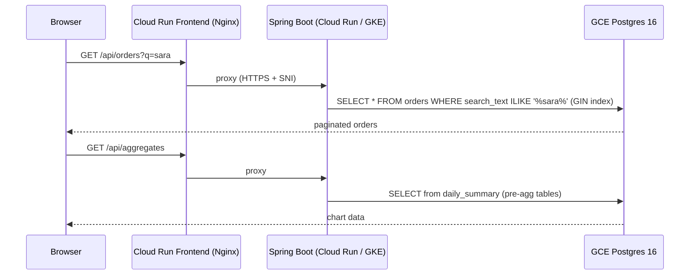

# Dashboard Backend — Spring Boot + GCP Cloud Run

Production-grade **Java 21 / Spring Boot 4** REST API delivering sub-second responses across
4 million orders: full-text search, pre-aggregated analytics tables, serverless autoscaling,
and declarative Pulumi IaC on GCP. Supports both Cloud Run and GKE as backend runtimes with
container images stored in Artifact Registry (analogous to ECR + ECS/EKS in AWS deployments).

---

## Live Service

| Endpoint | URL |
|---|---|
| **App** | available on demand |
| **API** | available on demand |
| **Portfolio demo** | https://bganguly.github.io/#orders_dashboard |

> Cloud Run scales to zero when idle; run deploy.sh to provision GCP infrastructure and start the service.

---

## Using the App

Open **`/explorer.html`** on the running backend to run live requests against every endpoint from the browser — no curl required.

1. **List orders** — `GET /api/orders` returns a paginated, date-sorted list of orders; response header shows total row count and query time.
2. **Full-text search** — `GET /api/orders?q=<term>` hits the GIN pg_bigm index; enter at least 2 characters and observe sub-second response times on 4 M+ rows.
3. **Aggregates** — `GET /api/aggregates?from=<date>&to=<date>&topCategories=<n>` returns daily order totals and revenue by product category from the pre-aggregated summary tables.
4. **Customers** — `GET /api/customers` lists customers; supports optional `q` filter.
5. **Regions** — `GET /api/regions` returns the distinct region list used by the filter sidebar in the frontend.

---

## Architecture

### Search & chart request flow — step by step

1. **Browser → Nginx frontend** — the React UI sends `GET /api/orders?q=sara` to the Cloud Run frontend service (Nginx on port 80), which proxies the `/api/*` path upstream to the Spring Boot backend over HTTPS with SNI.
2. **Spring Boot → GIN search** — Spring Boot issues `SELECT * FROM orders WHERE search_text ILIKE '%sara%'` against the GCE Postgres VM; the GIN index on the denormalized `search_text` column (name + notes + total + id + status + region + date) returns sub-second results across 4 M rows without a sequential scan.
3. **Chart path** — `GET /api/aggregates` is served entirely from pre-aggregated `daily_summary` and related rollup tables; Spring Boot never touches raw `orders` on the chart path.
4. **Secret injection** — Spring Boot reads `DATABASE_URL` from GCP Secret Manager at container start via `secretKeyRef`; no credentials are stored in the image or env files.
5. **Results → browser** — Spring Boot returns paginated JSON; the React frontend renders the orders table and Recharts chart.



### Topology

```
┌─────────────────────────────────────────────────────────────────────────┐
│                              GCP Project                                │
│                                                                         │
│   Artifact Registry                                                     │
│   ┌──────────────────┐                                                  │
│   │  frontend image  │                                                  │
│   │  backend image   │                                                  │
│   └──────────────────┘                                                  │
│           │ image pull                  Pulumi TypeScript (IaC)         │
│           ▼                             manages all resources below     │
│   ┌───────────────────────────────────────────────────────────────┐     │
│   │                       dash-vpc (private)                      │     │
│   │                                                               │     │
│   │  Cloud Run: dash-frontend      dash-backend (CR or GKE)      │     │
│   │  ┌─────────────────────────┐   ┌────────────────────────┐    │     │
│   │  │ Nginx (port 80)         │   │ Spring Boot (8080)     │    │     │
│   │  │ • serves Vite dist      │ HTTPS • REST /api/*        │    │     │
│   │  │ • proxies /api/* ───────┼──►│ • Flyway migrations   │    │     │
│   │  │   proxy_ssl_server_name │SNI│ • NamedParameterJdbc  │    │     │
│   │  │ • 0–3 instances         │   │ CR: 0–5 instances     │    │     │
│   │  └─────────────────────────┘   │ GKE: 1 pod, e2-std-2  │    │     │
│   │           ▲                    └──────────┬────────────┘    │     │
│   │           │ HTTPS                Direct VPC Egress          │     │
│   └───────────┼─────────────────────────────┼───────────────────┘     │
│               │                             │                           │
│           Browser              ┌────────────▼──────────┐               │
│                                │  GCE VM: Postgres 16  │               │
│                                │  dash-lite-pg         │               │
│                                │  • orders (4 M rows)  │               │
│                                │  • GIN index          │               │
│                                │  • pre-agg summary    │               │
│                                └───────────────────────┘               │
│                                                                         │
│   Secret Manager                                                        │
│   ┌──────────────────────┐                                              │
│   │ dash-database-url    │◄── secretKeyRef (backend container env)      │
│   └──────────────────────┘                                              │
└─────────────────────────────────────────────────────────────────────────┘

Deploy flow
───────────
local machine
  └─ deploy.sh
       ├─ docker build + push → Artifact Registry
       ├─ pulumi up --yes
       │    ├─ VPC / subnets / firewall
       │    ├─ GCE VM (Postgres 16, startup script installs + configures)
       │    ├─ Secret Manager secret (DATABASE_URL)
       │    ├─ Cloud Run frontend (BACKEND_URL env pointing at backend)
       │    └─ Cloud Run backend  [default]
       │         or GKE cluster + Deployment  [BACKEND_RUNTIME=gke]
       ├─ psql SSH row-count check → bake VM restore if DB empty
       └─ frontend deploy (chained)

Seed flow (bake VM, triggered when DB empty)
────────────────────────────────────────────
deploy.sh (auto) or scripts/bake-demo-snapshot.sh
  ├─ create ephemeral n2-standard-8 bake VM on same VPC
  ├─ gsutil cp gs://bikram-java-dash-snapshots/dash/demo-lite.dump → pg_restore
  └─ delete bake VM on completion
```

### Key design decisions

| Concern | Approach |
|---|---|
| **Search performance** | Denormalized `search_text` column (name + notes + total + id + status + region + date) with one GIN index — sub-second ILIKE on 4 M rows, single index hit per token, no cross-table OR |
| **Chart performance** | Pre-aggregated `daily_summary`, `daily_customer_category_summary`, `daily_status_category_summary`, `daily_filter_category_summary` — sub-second chart aggregates, queries never touch raw `orders` |
| **Trigger maintenance** | `fn_order_search_text()` (BEFORE INSERT/UPDATE on orders) + `fn_customer_name_to_orders()` (AFTER UPDATE on customers) keep `search_text` current without application-level logic |
| **Startup resilience** | Cloud Run startup probe with `failureThreshold: 60` × `periodSeconds: 15` = 15 min — survives long Flyway migrations (e.g. UPDATE + CREATE INDEX on 4 M rows) |
| **Zero-credential deploys** | Backend SA with `roles/secretmanager.secretAccessor` + `roles/cloudsql.client`; no passwords in code or Docker image |

---

## Stack

| Component | Implementation |
|---|---|
| **Java / Spring Boot back-end** | Spring Boot 4, Java 21, NamedParameterJdbcTemplate, Flyway |
| **PostgreSQL — SQL, DML/DDL, performance tuning** | GCE VM Postgres 16; Flyway DDL migrations; GIN index; pre-aggregated summary tables for sub-second chart queries on 4 M rows |
| **Serverless / cloud-native computing** | Cloud Run (default) or GKE — images in Artifact Registry; min-instances: 0, scales to zero, Direct VPC Egress to private Postgres; toggled via `BACKEND_RUNTIME` |
| **IaC (Terraform equivalent)** | Pulumi TypeScript (`infra/index.ts`) — VPC, GCE Postgres VM, Cloud Run service, IAM, Secret Manager, Artifact Registry all declared |
| **CI/CD pipelines** | `deploy.sh` — build → push to Artifact Registry → `pulumi up --yes`; auto bake via ephemeral GCE VM when DB is empty |
| **Secrets management** | GCP Secret Manager; `DATABASE_URL` injected at runtime via `secretKeyRef`, never stored in image or env file |
| **Networking, storage, DB architecture** | Private VPC, Direct VPC Egress, GCE VM Postgres on private IP (VPC firewall rules), pg-SSD boot disk |
| **BFF / integration layer** | Nginx frontend proxies `/api/*` to Cloud Run backend (TLS + SNI); Spring Boot orchestrates REST + DB |
| **RESTful APIs / microservices** | Two independent Cloud Run services; paginated list endpoint + aggregates endpoint |
| **Performance optimization** | Sub-second ILIKE search on 4 M rows via GIN index; pre-aggregated daily tables cut chart query time from seconds to milliseconds |
| **System design diagrams** | See architecture section below |

---


## Deployment / Running

```bash
./scripts/deploy.sh      # local [1] or GCP [2]
./scripts/infra-down.sh  # stop local [1] or teardown GCP [2]
```

`./scripts/deploy.sh` prompts for local or GCP on every run:

```
./scripts/deploy.sh
  [1] Local  — starts Spring Boot on :8080 (uses local PG from .env)
  [2] GCP    — docker build → push to Artifact Registry → pulumi up --yes
                 provisions VPC · GCE Postgres VM · Cloud Run backend · Secret Manager
                 auto-restores demo snapshot from GCS if orders table is empty
```

---

## Scale & Performance

> **4 M+ orders** in Cloud SQL PostgreSQL 16 — sub-second full-text search via GIN index on a denormalized `search_text` column; millisecond chart aggregates via pre-aggregated summary tables; zero sequential scans on the hot path.

```
Browser ──HTTPS──► Nginx / Cloud Run ──proxy /api/* (SNI)──► Spring Boot (CR or GKE) ──VPC──► GCE VM: Postgres 16
                   dash-frontend                             dash-backend                             dash-pg
                   0–3 instances                            CR: 0–5 / GKE: 1 pod                    4 M+ rows · GIN index
                                    ▲─────────────── Pulumi TypeScript IaC ──────────────────────────▲
```

---

## Snapshot Data

Demo data is seeded from a pre-built PostgreSQL dump stored in GCS:

```
gs://bikram-java-dash-snapshots/dash/demo-lite.dump
```

`deploy.sh` automatically triggers a restore when the `orders` table is empty:

1. Creates an ephemeral n2-standard-8 bake VM on the same VPC.
2. Runs `pg_restore` from the GCS snapshot into the GCE Postgres instance.
3. Deletes the bake VM on completion.

To manually trigger a restore:

```bash
./scripts/bake-demo-snapshot.sh
```

The snapshot contains 4 M+ orders across multiple customers, regions, and statuses — sized for realistic query performance testing without needing to generate synthetic data.

